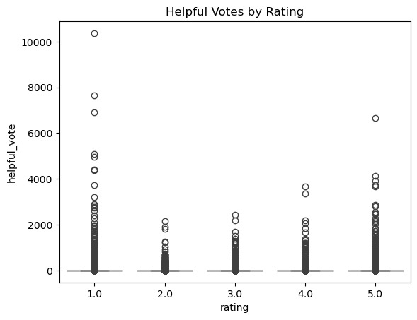
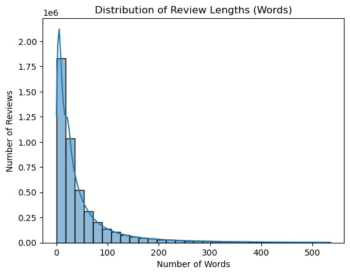
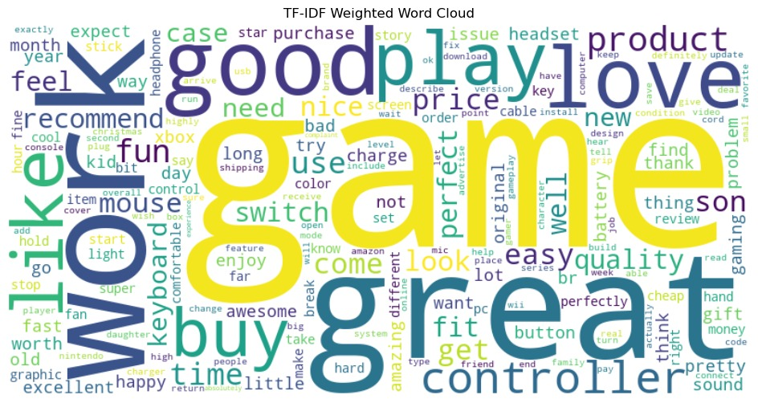
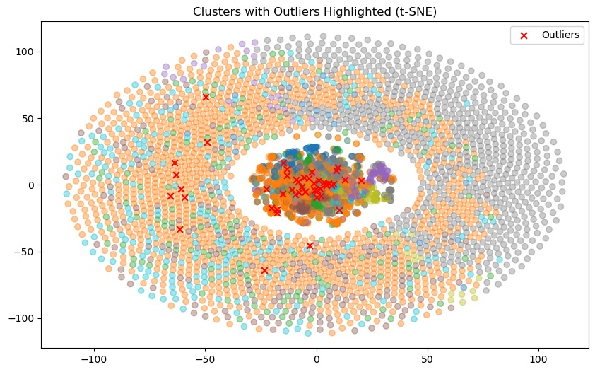

# amazon-review-anomaly-detection
Unsupervised anomaly detection on 4.6M Amazon reviews using NLP + clustering

##  Overview
Online product reviews are essential for decision-making, but they often contain noisy, misleading, or anomalous content.  
This project applies unsupervised machine learning techniques to detect unusual review patterns in a large-scale Amazon reviews dataset.

---

## Dataset
- Source: Amazon Reviews 2023 (Video Games subset)
- Size: ~4.6 million reviews  
- Sample used: 5,000 reviews (for computational efficiency)

**Features:**
- Numerical: rating, helpful votes  
- Text: review content, title  
- Boolean: verified purchase  

---

## Methodology

### 1. Text Preprocessing
- Lowercasing  
- Tokenization  
- Stopword removal  
- Lemmatization (spaCy)  

### 2. Feature Engineering
- TF-IDF vectorization of review text  

---

## Models

### K-Means Clustering
- Groups similar reviews based on TF-IDF features  
- Flags anomalies as points far from cluster centroids  
- Detects:
  - Short  
  - Vague  
  - Low-information reviews  

---

### Isolation Forest
- Randomly isolates observations in high-dimensional space  
- Flags reviews that are easy to separate  
- Detects:
  - Long reviews  
  - Reviews with rare or unusual word patterns  

---

## Key Visualizations

### Helpful Votes vs Rating


### Review Length Distribution


### TF-IDF Word Cloud


### Anomaly Detection (t-SNE Projection)


---

## Key Findings

- Ratings are heavily skewed toward high values  
- Extreme ratings (1 star and 5 star) receive the most engagement  
- Two distinct types of anomalies were identified:

### 1. Short Anomalies (K-Means)
- Very short or vague reviews  
- Low informational value  

### 2. Long Anomalies (Isolation Forest)
- Unusual vocabulary or structure  
- Potential fake, spam, or off-topic reviews  

---

## Limitations
- TF-IDF does not capture semantic meaning  
- Models rely only on text (no user behavior features)  
- K-Means assumes spherical clusters  
- Isolation Forest may flag legitimate long reviews  

---

## Tech Stack
- Python  
- pandas, numpy  
- scikit-learn  
- spaCy  
- matplotlib, seaborn  

---

## Project Structure
```
retail-intelligence-system/
│
├── notebooks/          # Experiments and analysis
├── results/            # Visualizations and metrics
├── reports/            # Technical report
└── README.md
```
